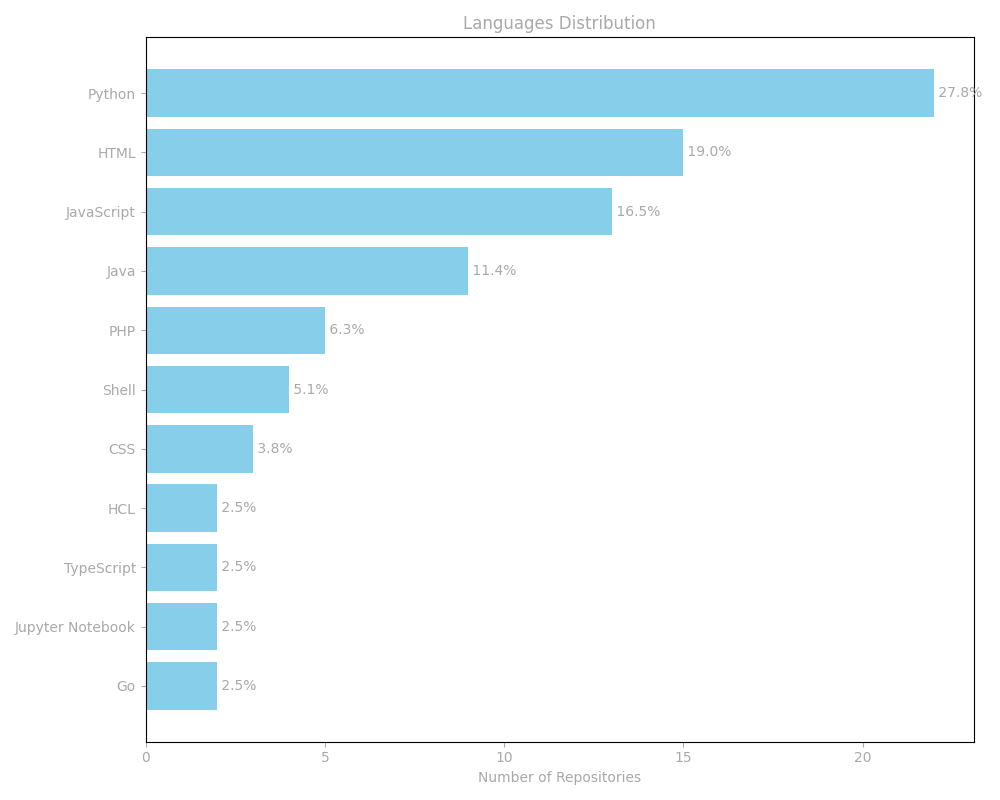

# Hello  !

[ :us: English Version](#)

Hi, :raising_hand_man:, I'm _**Juliano Lopes**_, a backend developer passionate about infrastructure and automation.

As I kept learning and diving deeper into the world of code, I had the opportunity to work in **technical SEO**, where I learned to see systems not just as software, but as **living ecosystems of performance and experience(UX)**.

Today, I bring that same mindset into building **APIs, CI/CD pipelines, and cloud architectures**, solutions that are scalable, testable, and efficient from development to deployment.

> 💡 “From optimizing websites to optimizing systems — the essence remains the same: delivering value through performance.”

[ :brazil: Versão em Português](#)

Olá, :raising_hand_man:, me chamo _**Juliano Lopes**_, sou desenvolvedor backend e entusiasta de infraestrutura e automação.

Conforme fui aprendendo e mergulhando cada vez mais no universo do código, tive a oportunidade de atuar no **SEO técnico**, onde aprendi a enxergar sistemas não apenas como código, mas como **ecossistemas de performance e experiência(UX)**.

Hoje, canalizo essa visão em projetos que unem **backend, pipelines CI/CD e cloud infrastructure**, construindo soluções escaláveis, testáveis e bem orquestradas — da aplicação ao deploy.

> 💡 “Da otimização de páginas à otimização de sistemas — a essência continua sendo entregar valor com eficiência.”

## :mortar_board: Education

-   :school: Bachelor in Information Technology at [Univesp](https://univesp.br/) (2020 - 2024).
-   :books: Postgraduate in Software Architecture at [Fiap](https://postech.fiap.com.br/) (2024 - 2025).

---

<!--STATS-START-->
### 📊 **GitHub Stats**
- 👥 Followers: **`92`**
- 📦 Public Repositories: **`100`**
- 🌟 Earned stars: **`4`**
- 💬 Most used languages: **`Python, HTML, JavaScript`**
- 🕓 Latest update: **`2025-11-10 06:21 UTC`**
<!--STATS-END-->

---

## &nbsp;&nbsp;&nbsp; Relevant repositories

(in construction...)

### :anchor: **APIs & Back-end**

| | | |
| --- | --- | --- |
| [Aplicação  ](https://github.com/ju-c-lopes/aplicacao-django) | A _**full-stack Django application**_ featuring CI/CD, containerization, and automated testing. This is a web application for managing classes taught according to the requirements of the *São Paulo's Curriculum* The project can be accessed in this link below: [https://aplicacao-django.fly.dev/](https://aplicacao-django.fly.dev/) |  |
| [Santander BootCamp](https://github.com/ju-c-lopes/santander-bootcamp-dio) [DIO](https://web.dio.me/)   | A challenge for create a **Swagger** documentation to save user data in database |  |
| [Blog Platform ](https://github.com/ju-c-lopes/model-blog-platform) | A project whose goal is being a platform to create posts for a website, building the templates, their components and providing informations through optimized SEO posts |  |

### :building_construction: Infrastructure & DevOps

| | | |
| --- | --- | --- |
| Cluster Kubernetes com Terraform (EKS)|  |  |
| Pipelines GitHub Actions (`infra-deploy.yaml`, `k8s-deploy.yaml`) |  | |
| Scripts de automação Bash e Python para deploy e monitoramento |  |  |

### :construction: Architecture & microservices (Tech Challenge)

| | | |
| --- | --- | --- |

### :hammer_and_wrench: Studies & Prototypes

| | | |
| --- | --- | --- |
| AluraCord | | |

### :art: Creative & Technical Content

| | | |
| --- | --- | --- |
| :studio_microphone: [RockTech podcast - Código Pesado](https://github.com/ju-c-lopes/podcast-codigo-pesado) |  |  |
| Mini ebook - [Entre Portas e Túneis](https://github.com/ju-c-lopes/ebook-ssh): Além dos horizontes do SSH Login |  |  |

## 📊 Language Distribution

---

  
  
   

<!--  -->
